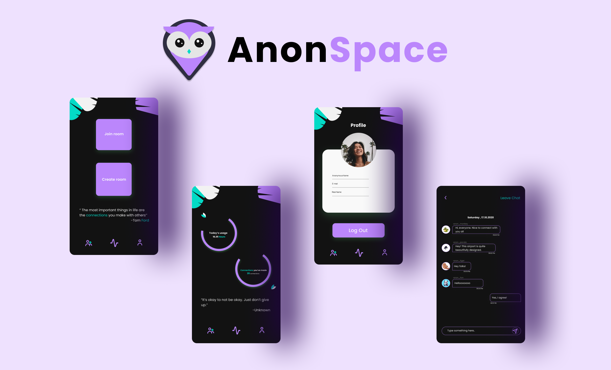
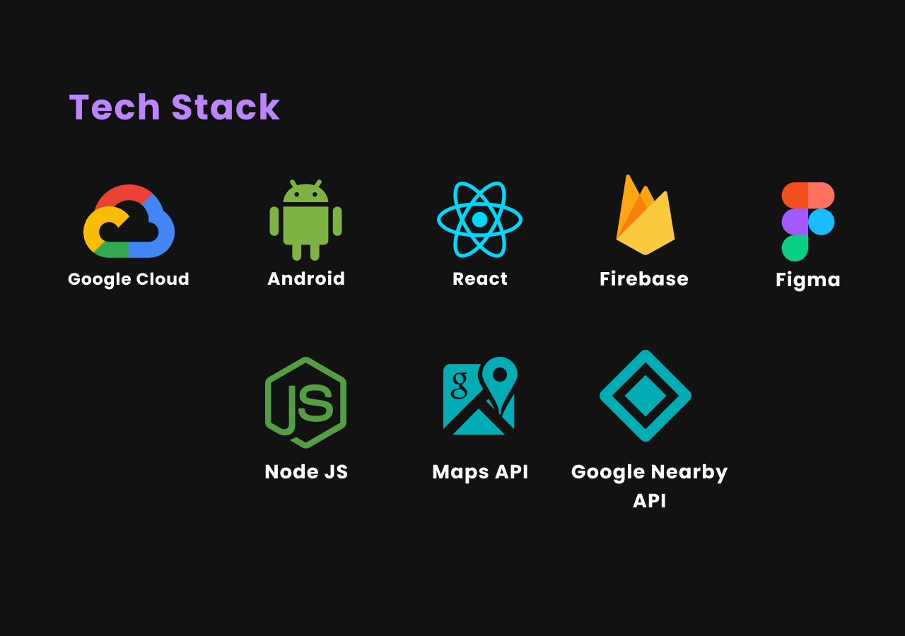

 
<h1 align="center">AnonSpace</h1>
 

**AnonSpace - The Anonymous Space** is a free online proximity based anonymous messaging app. 
It is designed to generate connections for people who are on the go.

 
<h2 align="center">How is this built?</h2>
 

This app is 100% written in **Kotlin**. **MVVM architecture** is used with **Android Architecture Components** and **Koin** for dependency injection. 
The Backend is written in **NodeJS** using **MVC architecture** and **Google Firebase Realtime Database**. 
The Web Frontend is written in **ReactJS**. 
Leveraging the **Google Nearby API** and **Location API** to connect with nearby AnonSpace users. 
We have leveraged the power of **Google Cloud Computing Engine** for filtering the abusive words as well as hosting the Backend.

 
<h2 align="center">Features</h2>
 

* Single SignIn with **Google authentication**.
* Create or join a room with people within 100 meters of a radius around you.
* You are completely **anonymous** throughout the app.
* **Dataset** has been used to **filter out the abusive or bad words**.
* Another **dataset** has been implemented to generate **motivational quotes**.
* **ROT Cipher** and complex mathematic algorrithms have been used for **End-to-End message encryption**.

 
<h2 align="center">Important Links</h2>
 

[AnonSpace Android App](https://drive.google.com/file/d/16PRllTm81TJir_p7tJuTsV6bvB-D7GhU/view?usp=sharing)
 
[AnonSpace Website](https://anonymou.space/) 
[AnonSpace Figma Prototype](https://www.figma.com/file/wKBzZthNPg8bvR7mtDzXch/Anonymous.Space?node-id=1%3A3)
 
[AnonSpace Backend Repository](https://github.com/r-ush/anonymouspace-backend/)
 
[AnonSpace Web Frontend Repository](https://github.com/r-ush/anonymouspace-frontend)

 
<h2 align="center">Team</h2>
 

* **Hemanth Krishna** [(@DarthBenro008)](https://github.com/DarthBenro008)
* **Malvika Rajesh** [(@MalvikaRajesh)](https://github.com/MalvikaRajesh)
* **Aarush Bhatt** [(@r-ush)](https://github.com/r-ush)
* **Shubham Palriwala** [(@ShubhamPalriwala)](https://github.com/ShubhamPalriwala)

 
<h2 align="center">What's next with AnonSpace?</h2>
 
* We plan to make our App cross-platform. 
* We aim to introduce a more secure asymmetric cryptographic algorithm such as RSA. 
* We would also like to introduce Social Twists to make the experience more fun and engaging.

 
<h2 align="center">License</h2>
 

Copyright 2020 Hemanth Krishna, Malvika Rajesh, Aarush Bhatt, Shubham Palriwala   
Licensed under MIT License :  https://opensource.org/licenses/MIT

 
 

	Made with :heart: by Team AnonSpace

